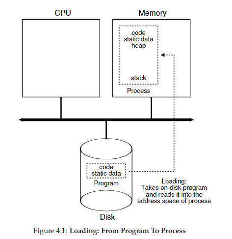
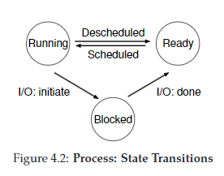

# 4 - The Process
- a **process** is a running program
- in order to run multiple processes at once, the OS creates the illusion of multiple CPUs by virtualizing the CPU
- achieves this by:
  - _mechanisms_ - low level methods or protocols that implement a needed piece of functionality
  - _policies_ - algorithms for making some kind of decision within the OS

- state of a process can be described by:
  - the contents of memory in its address space,
  - the contents of CPU registers (including the program counter and stack pointer, among others), and
  - information about I/O (such as open files which can be read or written)

## Sharing
- _time sharing_ - allowing one entity to use a resource for a little while then context switching to allow another entity to use the resource (e.g., CPU, network link)
- _space sharing_ - a resource is divided in space among users (e.g., disk space)

- understanding process is understanding machine state
  - memory - where programs instructions live via address space
  - registers - things like program counter/instruction pointer (what the next instruction is)
  - I/O info

## Process API
- **create** - method to create new processes
- **destroy** - method to destroy running processes
- **wait** - method to pause a running process
- **misc. control** - other special methods, like suspend or resume
- **status** - get status info about process

programs can either be loaded
- **eagerly**: all at once before running the program
- **lazily**: loading pieces of code or data only as they are needed during program execution

how are programs turned into processes?
1. code and any static data loaded into memory
   1. this used to be done eagerly (load the whole program into memory), now it is typically done lazily (load only needed modules)
2. stack is provisioned
   1. in C programs, stack is used for variables, function parameters, etc
3. program might also allocate memory for program's heap
   1. in C programs, memory for heap gets provisioned with `malloc()` and freed with `free()`
4. OS will do other initialization tasks such as setting up file descriptors (standard out, standard in, standard err)

## Process States
RUNNING - the process is using the CPU right now
READY   - the process could be using the CPU right now
          but (alas) some other process is
BLOCKED - the process is waiting on I/O
          (e.g., it issued a request to a disk)
DONE    - the process is finished executing
ZOMBIE  - the process has completed executing but there is still an entry in the process table

- there are potentially other process states, for example

`enum proc_state { UNUSED, EMBRYO, SLEEPING, RUNNABLE, RUNNING, ZOMBIE };`

## Data Structures
- **process list** - aka task list, keeps track of all running programs
- **process control block** - aka process descriptor, individual structure that stores information about each process, an entry in the process list
