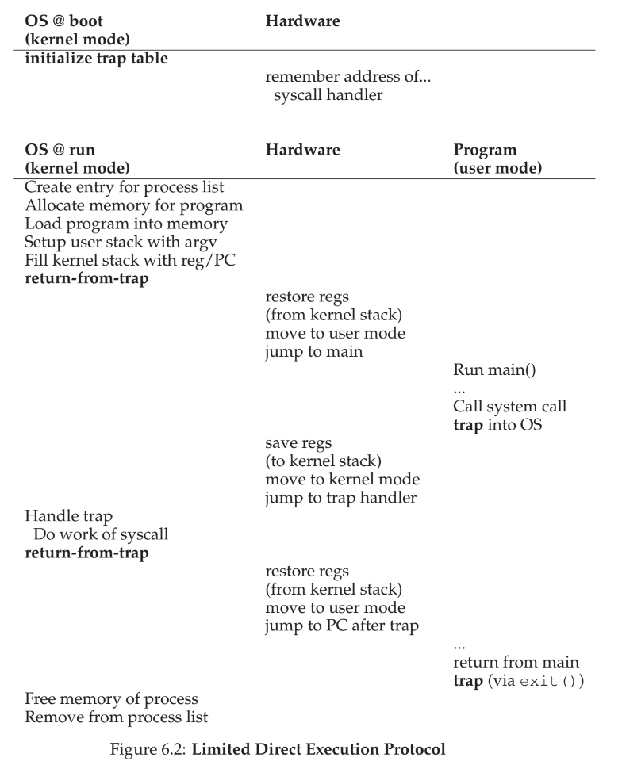

# 6 - Limited Direct Execution
- when virtualizing a CPU via time sharing, need to be concerned with
    1. _performance_ - how to implement virtualization without excessive overhead
    2. _control_ - how can run processes while retaining control over CPU

**limited direct execution** - run a program directly on the CPU, with limits on how long a process can run on the CPU

when the OS wants to start a program, it
1. creates a process entry in the process list
2. allocates memory
3. loads the program code into memory
4. locates the entry point
5. jumps to the entry point
6. starts running

## Processor Modes
- **user mode** - code run here is restricted in what it can do
- **kernel mode** - used for privileged operations like I/O or restricted instructions, and is the mode the OS runs in

**system calls** - allow the kernel to carefully expose certain key pieces of functionality to user programs
    - accessing the file system
    - creating and destroying processes
    - communicating with other processes
    - allocating more memory

- a trap saves caller's registers so it can return correctly by pushing data to the kernel stack; a **return from trap** operation will pop these values off the stack
- **trap instruction** - program must execute this in order execute a system call; instruction jumps into kernel and raises the privilege to kernel mode
- **trap table** - a table of what happens on exceptional events like keyboard interrupts, and is set up at boot time

## Switching Between Processes
- **cooperative** - OS trusts processes to give up control to the CPU periodically
- **non-cooperative** - OS implements a mechanism like a _timer interrupt_ to take back control of CPU

**context switch** - low-level technique to switch from one running process to another