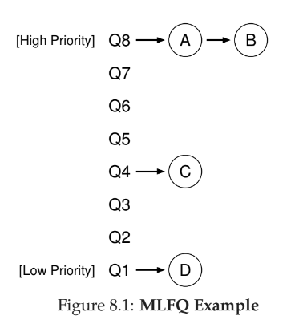

# 8 - Multi-Level Feedback Queue
- for most jobs, we won't know length of jobs, so
  1. how do we optimize for turnaround time, and
  2. how do we make a system feel responsive for interactive users?

- multi-level feedback queue has multiple levels of queues, and uses feedback to determine priority of given job
-  instead of demanding _a priori_ knowledge of the nature of a job, it observes the execution of a job and prioritizes it accordingly
-  manages to achieve the best of both worlds: it can deliver excellent overall performance (similar to SJF/STCF) for short-running interactive jobs, and is fair and makes progress for long-running CPU-intensive workloads
- can be difficult to parameterize: how many queues should there be, how big should the time slice be

- many systems, including BSD UNIX derivatives, Solaris, and Windows NT and subsequent Windows operating systems use a form of MLFQ as their base scheduler
- some schedulers allow you to give **advice** to help set priority (can be used or ignored) - e.g., linux tool `nice`
- other schedulers use a **decay-usage** algorithm to adjust priorities (instead of a table or exact rules below)

- two problems with MLFQ
    1. process **starvation**: interactive jobs will take all the CPU time from non-interactive processes
    2. **gaming the scheduler** - a process tricking the scheduler into giving more time to the process
    3. a process might change its behavior, increasing in interactivity but not treated as such

**priority boosts** helps with process starvation by periodically bumping up the priority of jobs running in lower queues
**voodoo constants** - constants that require some sort of black magic to set correctly

general rules outlined:
- **Rule 1:** If Priority(A) > Priority(B), A runs (B doesn’t).
- **Rule 2:** If Priority(A) == Priority(B), A & B run in round-robin fashion using the time slice (quantum length) of the given queue.
- **Rule 3:** When a job enters the system, it is placed at the highest priority (the topmost queue).
- **Rule 4:** Once a job uses up its time allotment at a given level (regardless of how many times it has given up the CPU), its priority is reduced (i.e., it moves down one queue).
- **Rule 5:** After some time periodS, move all the jobs in the system to the topmost queue.
