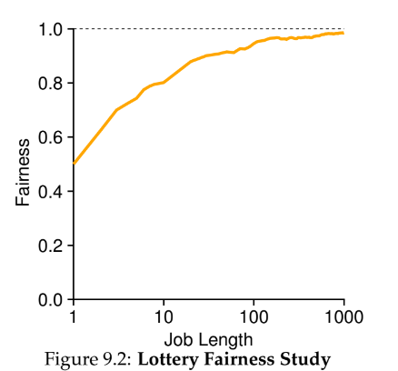
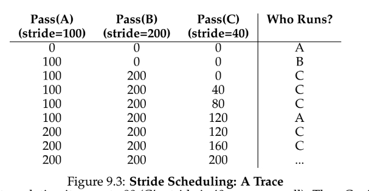
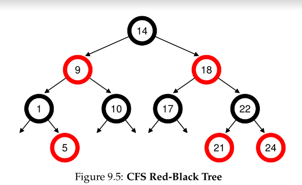

# 9 - Scheduling - Proportional Share
**proportional share (_fair-share_) scheduling** - instead of optimizing turnaround time, a scheduler might guarantee that each job obtain a certain percentage of CPU time

## lottery scheduling
- a non-deterministic, probabilistic fair share scheduling algorithm
- every so often, hold a lottery to determine which process runs next
- **tickets** - represent the share of a resource that a process should receive

### ways to manipulate tickets
- **ticket transfer** - allows a user with a set of tickets to allocate tickets among their own jobs in whatever currency they want, then those tickets are converted to global currency
- **ticket transfer** - a process can temporarily hand off its tickets to another process
- **ticket inflation** - a process can temporarily raise of lower the number of tickets it owns

lottery scheduling uses _randomness_, which
    1. often avoids strange corner-cases
    2. is lightweight, requiring little state to manage
    3. can be quite fast, as long as number generation is quick

- when job length isn't very long, lottery isn't very fair

## stride scheduling
- a deterministic fair share scheduling algorithm
- each process has a **stride** value which determines how long they run; as they run, their **pass** value is incremented to track global progress
- biggest drawback is that there is global state per process to manage; how do you handle new jobs that enter the system -- can't set the pass to 0 or it will monopolize CPU

## linux's completely fair scheduler (CFS)
- scheduling uses about 5% of overall datacenter CPU time
- **virtual runtime (vruntime)** simple counting-based technique to divide CPU time
- each processes _vruntime_ increases at the same rate in proportion to real time, and the scheduler will pick the process with the lowest _vruntime_ to run next

### CFS parameters
- **sched_latency** - determines how long a process should run before considering a switch; typical value is 48 (ms)
- **min_granularity** - CFS will never set the time slice of a process to less than this value; typical value is 6 (ms)
- **niceness** - a way to weight jobs and give priority -- positive values imply _lower_ priority

### red-black trees
- CFS uses red-black trees (a balanced binary tree) to identify which job to run next
- this is logarithmic (not linear)
- only contains running jobs

