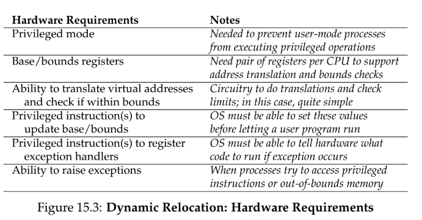
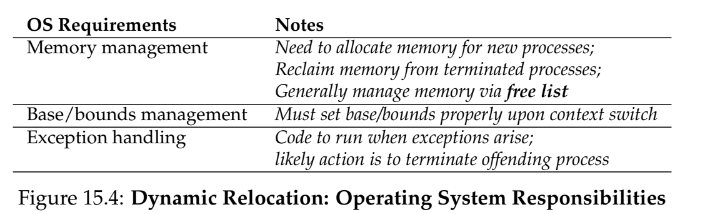
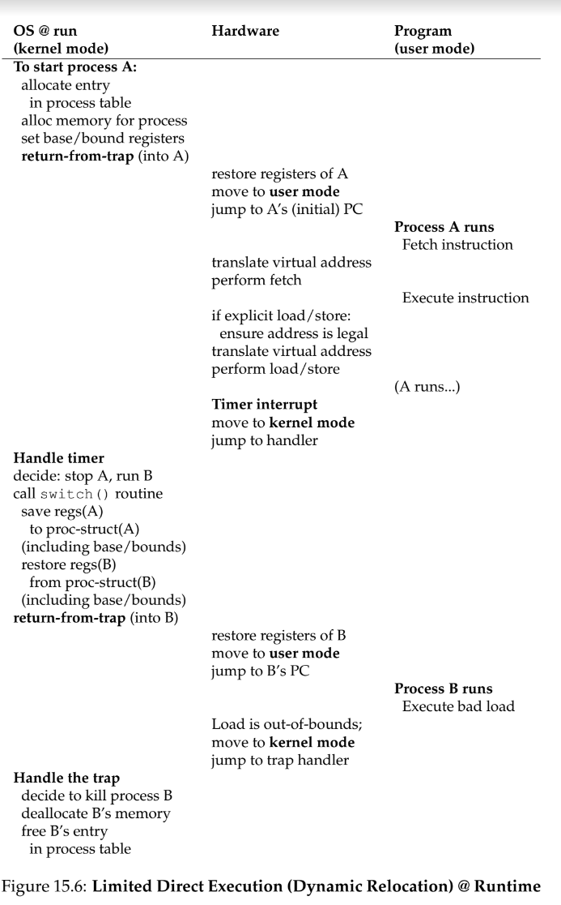

# 15 - Mechanism: Address Translation
**hardware-based address translation** - hardware **interposes** on each memory access (e.g., an instruction fetch, load, or store) changing the _virtual_ address to a _physical_ address where the data actually resides
- OS must be involved to set up hardware to manage memory
- `objdump` on Linux allows us to disassemble C to assembly

## base and bounds (dynamic) relocation
- two hardware registers, a base register and a bounds/limit register
- this relocation happens at runtime and is thus dynamic (rather than static)
- `physical address = virtual address + base`
- if a process generates a virtual address that is greater than the bounds or one that is negative, the CPU will raise an exception
- **memory management unit** - the part of the processor that helps with address translation

### hardware support

### os support

**free list** - a data structure that lists free space available
**internal fragmentation** - base and bounds leads to wasted space within the allocated unit

