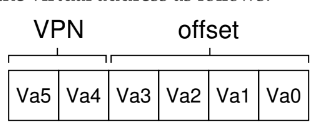

# 18 - Paging
- **segmentation** chops up data into _variable-sized_ chunks, leading to **fragmentation**
- **paging** divides memory into _fixed-sized_ chunks, each called a **page**
- physical memory is then an array of fixed-sized slots called **page frames**
- paging has several benefits:
  - _flexibility_ - the address space abstraction is fully supported, and no assumptions about how stack and heap grow need to be handled
  - _simplicity_ - just need to find free pages to use for address space

## translation
- split virtual address into **virtual page number (VPN)** and **offset**
- replace the virtual page number with the **physical frame number (PFN)** (sometimes called the **physical page number (PPN)**)
- offset tells us which byte within the page we want

## page tables
- **page table** - per process data structure that the OS keeps to store **address translations**, which lets OS know where in physical memory a page resides
- **page table entry (PTE)** - stores actual physical translation
  - 20 bit VPN implies 2^20 translations, and at 4 bytes per PTE that is 4MB for each page table, and if there are 100 processes, thats 400MB
- they can get much larger than a small segment table or base/bounds pair
- simplest form is a **linear page table**, which is just an array
  - OS indexes array by virtual page number and look sup the page-table entry at that index to find the physical frame number
- many different bits to to dictate behavior:
  - **valid bit** - common to indicate whether the particular translation is valid
  - **protection bit** - can the page be read from, written to, or executed from
  - **present bit** - whether this page is in physical memory or on disk (i.e., has been **swapped**)
  - **dirty bit** - whether page has been modified since brought into memory
  - **reference bit (accessed bit)** - whether page has been accessed

- without careful design of both hardware and software, page tables cause system to run too slowly and take up too much memory