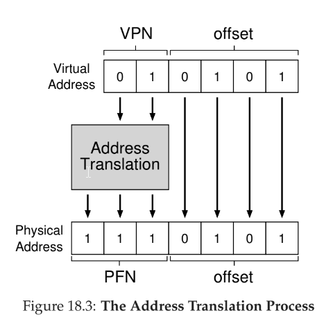

# 18 - Paging
- **segmentation** chops up data into _variable-sized_ chunks, leading to **fragmentation**
- **paging** divides memory into _fixed-sized_ chunks, each called a **page**
- physical memory is then an array of fixed-sized slots called **page frames**
- paging has several benefits:
  - _flexibility_ - the address space abstraction is fully supported, and no assumptions about how stack and heap grow need to be handled
  - _simplicity_ -
- **page table** - per process data structure that the OS keeps to store **address translations**, which lets OS know where in physical memory a page resides

## translation
- split virtual address into **virtual page number (VPN)** and **offset**

