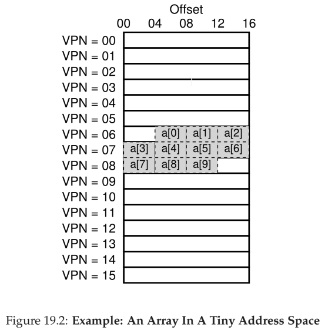
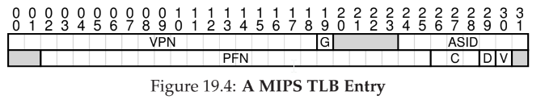

# 18 - Translation-Lookaside Buffers
- going to paging table for every address translation is costly
- **translation-lookaside buffer (TLB)** - part of the chip's **memory management unit (MMU)** and is a hardware cache of popular virtual-to-physical address translations

TLB control flow algo

```c
VPN = (VirtualAddress & VPN_MASK) >> SHIFT
(Success, TlbEntry) = TLB_Lookup(VPN)
if (Success == True) // TLB Hit
    if (CanAccess(TlbEntry.ProtectBits) == True)
        Offset = VirtualAddress & OFFSET_MASK
        PhysAddr = (TlbEntry.PFN << SHIFT) | Offset
        Register = AccessMemory(PhysAddr)
    else
        RaiseException(PROTECTION_FAULT)
else // TLB Miss
    PTEAddr = PTBR + (VPN * sizeof(PTE))
    PTE = AccessMemory(PTEAddr)
    if (PTE.Valid == False)
        RaiseException(SEGMENTATION_FAULT)
    else if (CanAccess(PTE.ProtectBits) == False)
        RaiseException(PROTECTION_FAULT)
    else
        TLB_Insert(VPN, PTE.PFN, PTE.ProtectBits)
        RetryInstruction()
```

1. extract virtual page number (VPN) from virtual address
2. check if VPN in TLB
3. if yes:
    1. extract page frame number (PFN)
    2. concatenate onto the offset from the virtual address
    3. access memory at physical address
 1. if no:
    1. check the page table for translation
    2. if not valid, raise exception
    3. update TLB
    4. retry from step 2



- hardware caches take advantage of spatial and temporal locality
- **spatial locality** - if a program accesses memory at address _x_, it will likely soon access memory near _x_.
- **temporal locality** - an instruction or data item that has been recently accessed will likely be re-accessed soon in the future

## Who handles a TLB miss?
- either hardware or OS

**hardware**
- in older systems, hardware had a complex set of instruction sets (**complex-instruction set computers CISC**)
- hardware needs to know exactly where in memory a page table is via a **page-table base register**
- on miss, hardware walks page table, finds the relevant page table entry, updates TLB, and tires again
- example is Intel x86, which uses a **multi-level page table**

**software**
- more modern systems have limited instruction sets
- **reduced-instruction set computers (RISC)**
- on miss, hardware raises exception, traps into kernel and jumps to a trap handler
- unlike other traps which resume program excecution after the trap, when OS returns from trap it needs to start at where the call to memory started
- also needs to prevent infinite TLB calls -- could use wired translations or unmapped handlers
- benefits are simplicity and flexibility

**fully-associative cache** - any given translation can be anywhere in the TLB (compared to direct-mapped cache entries, which are indexed, or less permissive set-associative caches)

## How to handle context switches
- when a process is context switched, the TLB entries will be incorrect for the new process's page table
- can simply flush the TLB, but this is expensive and not performance
- system can provide an address space identifer (ASID) to associate a TLB entry with process
- processes can share code and thus point to same physical frame number

## Cache replacement
- **least recently used (LRU)**
- **random** - simpler, avoidance of corner-cases



**exceeding TLB coverage** - if number of pages a program access exceeds number of pages that fit into TLB, many misses will occur