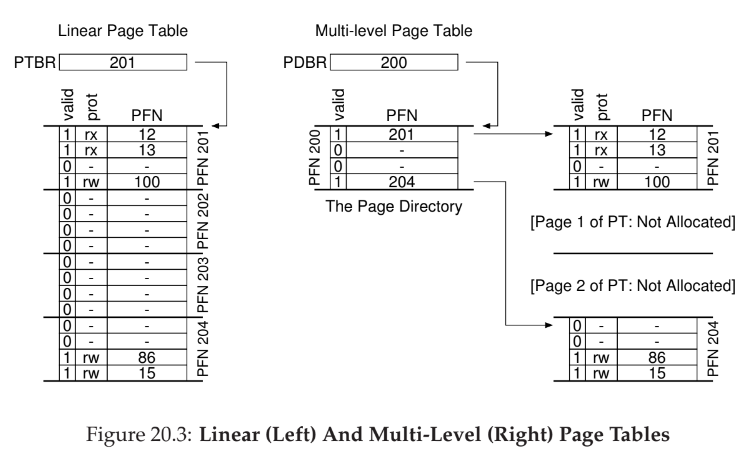
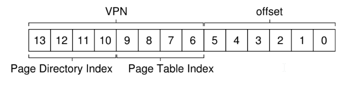

# 20 - Paging: Smaller Tables
- page tables without any optimizations are too large and consume too much memory
- simple solution: use bigger tables, but this leads to waste within each page (**internal fragmentation**, as waste is **internal** to the unit of allocation)

## Hybrid: Paging and Segments
- have a page table for each logical segment instead of the whole address space
- base (from **base and bounds/limits**) points to the physical address of the page table (rather than where in physical memory address space begins)

### cost of paging and segments
- segmentation is not as flexible as possible as it assumes a certain usage pattern of the address space
- also causes external fragmentation to occur

## Multi-level Page Tables
- turns the linear page table into something like a tree
- chop up page table into page-sized units, then, if entire page-table entries (PTE) is invalid, don't allocate that page
- introduces a **page directory** which holds whether page table is valid and where it is in physical memory



- **page directory** contains one entry per page of the page table (**page directory entries (PDE)**)
- a **page directory entry** has a **valid bit** and a **page frame number (PFN)**
- for a large page table, it is difficult to find continguous memory, but page directory allows for level of indirection where we can put page-tables anywhere in physical memory
- you can also have more than two levels, but you need to increase VPN size
  - how many page table entires fit within a page, and use that as index

### cost of multi-level page tables
- time-space trade-off: less time equals more space, and vice versa -- on TLB miss, two loads from memory will be required (one for page directory, and one for page table entry (PTE))
- adds complexity in OS or hardware handling lookup



`PDEAddr = PageDirBase + (PDIndex * sizeof(PDE))`

`PTEAddr = (PDE.PFN << SHIFT) + (PTIndex * sizeof(PTE))`

multi-level page table control flow
```c
VPN = (VirtualAddress & VPN_MASK) >> SHIFT
(Success, TlbEntry) = TLB_Lookup(VPN)
if (Success == True) // TLB Hit
    if (CanAccess(TlbEntry.ProtectBits) == True)
        Offset = VirtualAddress & OFFSET_MASK
        PhysAddr = (TlbEntry.PFN << SHIFT) | Offset
        Register = AccessMemory(PhysAddr)
    else
        RaiseException(PROTECTION_FAULT)
else // TLB Miss
// first, get page directory entry
    PDIndex = (VPN & PD_MASK) >> PD_SHIFT
    PDEAddr = PDBR + (PDIndex * sizeof(PDE))
    PDE = AccessMemory(PDEAddr)
    if (PDE.Valid == False)
        RaiseException(SEGMENTATION_FAULT)
    else
    // PDE is valid: now fetch PTE from page table
        PTIndex = (VPN & PT_MASK) >> PT_SHIFT
        PTEAddr = (PDE.PFN << SHIFT) + (PTIndex * sizeof(PTE))
        PTE = AccessMemory(PTEAddr)
        if (PTE.Valid == False)
            RaiseException(SEGMENTATION_FAULT)
        else if (CanAccess(PTE.ProtectBits) == False)
            RaiseException(PROTECTION_FAULT)
        else
            TLB_Insert(VPN, PTE.PFN, PTE.ProtectBits)
            RetryInstruction()
```

## Inverted Page Tables
- instead of having many page tables (one per process), use a single page table that has an entry for each physical page of the system