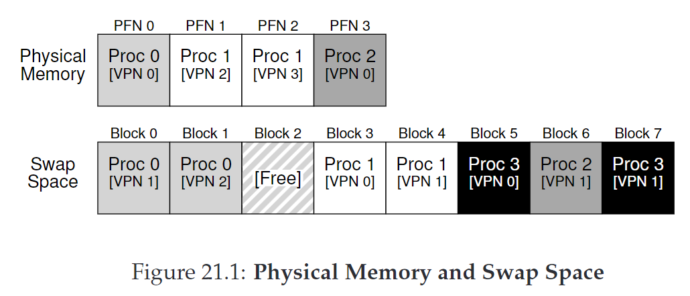

# 21 - Beyond Physical Memory: Mechanisms
- in order to support larger address spaces, OS needs a place to stash additional portions of address space that isn't in great demand
- modern systems use hard disk drive for this
- older systems used  **memory overlays**, which required programmers to manually move pieces of code or data in and out of memory

## Swap Space
- allows OS to support the illusion of large virtual memory for multiple concurrently-running processes
- swap pages out of memory to a space, and swap pages into memory from it



- **present bit** - additional piece of data in the page-table entry (PTE) that says whether data is in memory or in swap space
  - if set to 1, the page is present in physical memory; 0, it is not in memory but on disk somewhere


## Page Faults
- accessing a page that is not in physical memory triggers a page fault, and resolution is handled via a **page-fault handler**
- page faults typically handled by operating system (rather than hardware) because:
    1. page faults to disk are slow, so additional overhead of OS instructions are minimal
    2. hardware would need to understand swap space, how to issue I/Os to the disk, and other details

**3 cases when a TLB miss occurs**
  1. page present and valid -> update TLB, try again
  2. page not present -> page-fault handler
  3. page not valid -> seg fault

### Page-Fault Control Flow Algorithm (Hardware)

```c
VPN = (VirtualAddress & VPN_MASK) >> SHIFT
(Success, TlbEntry) = TLB_Lookup(VPN)
if (Success == True) // TLB Hit
    if (CanAccess(TlbEntry.ProtectBits) == True)
        Offset = VirtualAddress & OFFSET_MASK
        PhysAddr = (TlbEntry.PFN << SHIFT) | Offset
        Register = AccessMemory(PhysAddr)
    else
        RaiseException(PROTECTION_FAULT)
else // TLB Miss
    PTEAddr = PTBR + (VPN * sizeof(PTE))
    PTE = AccessMemory(PTEAddr)
    if (PTE.Valid == False)
        RaiseException(SEGMENTATION_FAULT)
    else
        if (CanAccess(PTE.ProtectBits) == False)
            RaiseException(PROTECTION_FAULT)
    else if (PTE.Present == True)
        // assuming hardware-managed TLB
        TLB_Insert(VPN, PTE.PFN, PTE.ProtectBits)
        RetryInstruction()
    else if (PTE.Present == False)
        RaiseException(PAGE_FAULT)
```

### Page-Fault Control Flow Algorithm (Software)

```c
PFN = FindFreePhysicalPage()
if (PFN == -1) // no free page found
    PFN = EvictPage() // run replacement algorithm
DiskRead(PTE.DiskAddr, PFN) // sleep (waiting for I/O)
PTE.present = True // update page table with present
PTE.PFN = PFN // bit and translation (PFN)
RetryInstruction() // retry instruction
```

### Page-Replacement Policy
- if memory is full, need a way to evict/replace pages
- typically an active process, handled by a swap/page daemon
  - high watermark and low watermark -- if there are fewer than LW pages, a background process evicts pages until there is HW pages available
- many replacements happen at once, which allows for performance optimizations by clustering (which reduces seek and rotational overheads of a disk)