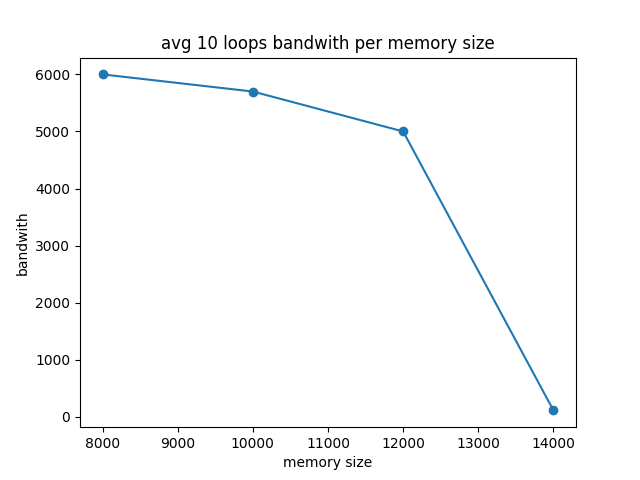
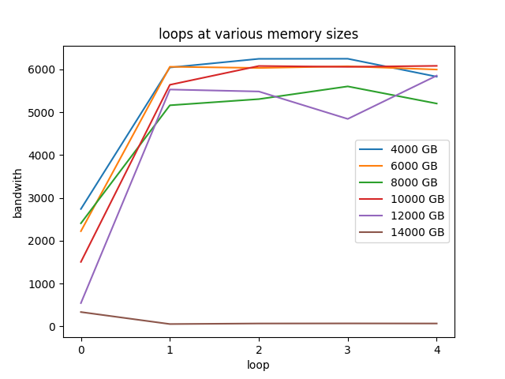

# Homework

[mem.c README](https://github.com/remzi-arpacidusseau/ostep-homework/blob/master/vm-beyondphys/README.md)

1. First, open two separate terminal connections to the same machine, so that you can easily run something in one window and the other. Now, in one window, run `vmstat 1`, which shows statistics about machine usage every second. Read the man page, the associated README, and any other information you need so that you can understand its output. Leave this window running vmstat for the rest of the exercises below. Now, we will run the program `mem.c` but with very little memory usage. This can be accomplished by typing `./mem 1` (which uses only 1 MB of memory). How do the CPU usage statistics change when running `mem`? Do the numbers in the user time column make sense? How does this change when running more than one instance of mem at once?

    - Time spent idle (id) decreases (from 100 to 92%) and time running non-kernel code (us) increased from 0 to 8%. User time makes sense. Each mem instance takes up about ~9% of CPU time, 1% for kernel time and 8% for user time. Adding up user time (us), kernel calls (sy) and idle time (id) get you to 100%.

2. Let’s now start looking at some of the memory statistics while running mem. We’ll focus on two columns: `swpd` (the amount of virtual memory used) and `free` (the amount of idle memory). Run `./mem 1024` (which allocates 1024 MB) and watch how these values change. Then kill the running program (by typing control-c) and watch again how the values change. What do you notice about the values? In particular, how does the free column change when the program exits? Does the amount of free memory increase by the expected amount when mem exits?

    - `swpd` doesn't change from 0, but free drops around ~1,050,820, or 1 MB, which is expected. Once you stop running the program, the free memory increases as you'd expect, adding back the roughly 1 MB that was allocated when the program ran.

3. We’ll next look at the swap columns (`si` and `so`), which indicate how much swapping is taking place to and from the disk. Of course, to activate these, you’ll need to run mem with large amounts of memory. First, examine how much free memory is on your Linux system (for example, by typing `cat /proc/meminfo`; type `man proc` for details on the /proc file system and the types of information you can find there). One of the first entries in `/proc/meminfo` is the total amount of memory in your system. Let’s assume it’s something like 8 GB of memory; if so, start by running mem 4000 (about 4 GB) and watching the swap in/out columns. Do they ever give non-zero values? Then, try with 5000, 6000, etc. What happens to these values as the program enters the second loop (and beyond), as compared to the first loop? How much data (total) are swapped in and out during the second, third, and subsequent loops? (do the numbers make sense?)

    - The first loop takes a really long time to run, and then subsequent loops run much faster. My machine has about ~12.5 GB free memory, so running with 5, 6 or even 10 GB didn't seem to trigger swap space to be used. Once I ran it with 12 GB though, after the first run, I got about 200 KB of swap space, which, interestingly, didn't recede once I stopped running the program, although the swap in and swap out returned to 0s. There seem like sporadic swap ins and swap outs, especially as I type in an editor. This also makes I/O jump up. Once I stop typing in the editor, numbers return to normal. VS Code likely persists things to disk in some sort of cache.

4. Do the same experiments as above, but now watch the other statistics (such as CPU utilization, and block I/O statistics). How do they change when mem is running?

    - Not much of a change if nothing else is happening, but depending on what else is running on the computer, these stats might spike. As mentioned above, I can trigger some I/O when typing in a VS Code editor. Also, I'm a dummy. VS Code might be doing some I/O, but swapping to and from disk would register as I/O since the swap space is on disk and you are reading and writing to it.

5. Now let’s examine performance. Pick an input for mem that comfortably fits in memory (say 4000 if the amount of memory on the system is 8 GB). How long does loop 0 take (and subsequent loops 1, 2, etc.)? Now pick a size comfortably beyond the size of memory (say 12000 again assuming 8 GB of memory). How long do the loops take here? How do the bandwidth numbers compare? How different is performance when constantly swapping versus fitting everything comfortably in memory? Can you make a graph, with the size of memory used by mem on the x-axis, and the bandwidth of accessing said memory on the y-axis? Finally, how does the performance of the first loop compare to that of subsequent loops, for both the case where everything fits in memory and where it doesn’t?

    Something that fits into memory: the first loop takes a while, but the second and subsequent loops are much faster.

    ```console
    mike@DESKTOP-EO1SSPM ~/projects/ostep-homework/homework/21-memory-mechanisms (master)$ ./mem 6000
    allocating 6291456000 bytes (6000.00 MB)
    number of integers in array: 1572864000
    loop 0 in 2212.95 ms (bandwidth: 2711.31 MB/s)
    loop 1 in 956.59 ms (bandwidth: 6272.27 MB/s)
    loop 2 in 982.20 ms (bandwidth: 6108.72 MB/s)
    loop 3 in 966.75 ms (bandwidth: 6206.37 MB/s)
    ```
    

    - Something that doesn't fit into memory: the first loop is slow, but the subsequent loops are a factor of 10 slower (14 GB with 12GB free). Swapping to and from memory is really, really slow if you need to do it a bunch.

    ```console
    mike@DESKTOP-EO1SSPM ~/projects/ostep-homework/homework/21-memory-mechanisms (master)$ ./mem 14000
    allocating 14680064000 bytes (14000.00 MB)
    number of integers in array: 3670016000
    loop 0 in 21507.49 ms (bandwidth: 650.94 MB/s)
    loop 1 in 167560.26 ms (bandwidth: 83.55 MB/s)
    loop 2 in 194535.56 ms (bandwidth: 71.97 MB/s)
    ```

    

6. Swap space isn’t infinite. You can use the tool `swapon` with the `-s` flag to see how much swap space is available. What happens if you try to run mem with increasingly large values, beyond what seems to be available in swap? At what point does the memory allocation fail?

    - Seems like I have 4194304 (4 MB) of swap space via `/swap/file`. Memory allocation fails when I allocate somewhere shy of my free memory plus swap space. For example, I have 12469920 kb free, and running `./mem 1600` fails but I can run `./mem 1500`.

7. Finally, if you’re advanced, you can configure your system to use different swap devices using `swapon` and `swapoff`. Read the man pages for details. If you have access to different hardware, see how the performance of swapping changes when swapping to a classic hard drive, a flash-based SSD, and even a RAID array. How much can swapping performance be improved via newer devices? How close can you get to in-memory performance?