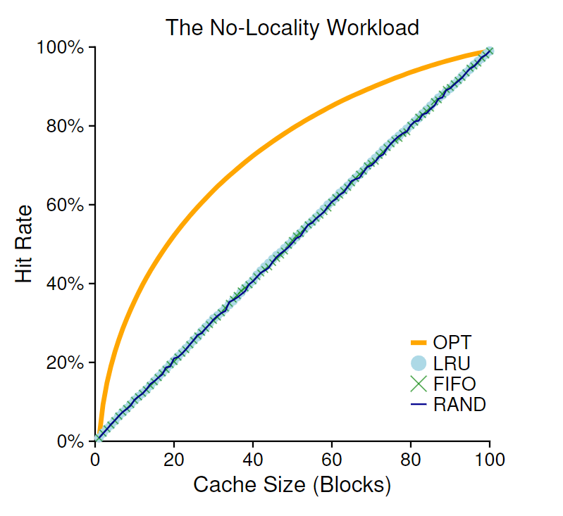
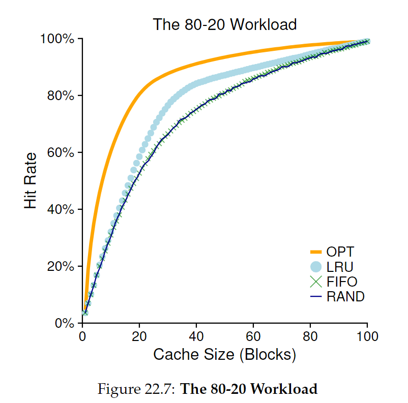
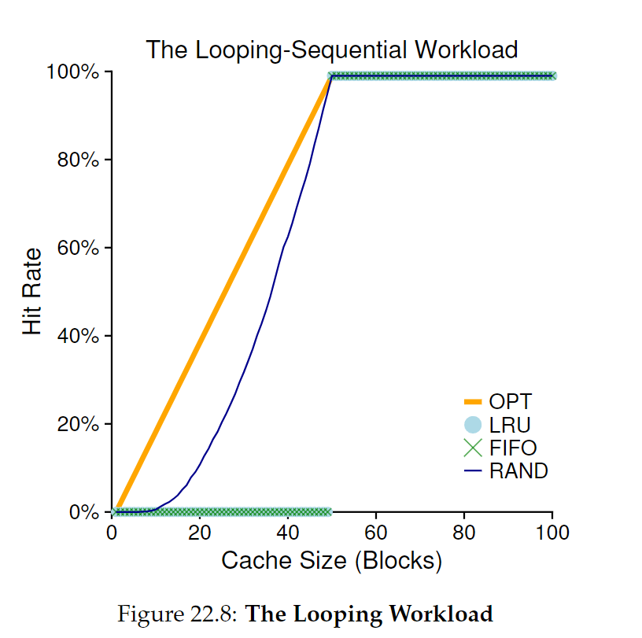

# 22 - Beyond Physical Memory: Policies

memory pressure

## Cache Management
main memory holds some subset of all pages, can be though of as a cache for virtual memory pages in system
goal is to minimize number of cache misses (how many times fetch a page from disk)
**average memory access time (AMAT)** - AMAT = Tm + (Pmiss * Td)
    - Tm: cost of accessing memory
    - Pmiss: probability of cache miss
    - Td: the cost of accessing disk

3 types of cache misses:
1. **cold-start/compulsory** - cache is empty to begin with, and this is first reference to item
2. **capacity** - cache ran out of space and had to evict an item
3. **conflict** - results in hardware because of limits on where an item can be placed in hardware cache (due to set-associativity) -- OS page cache is fully-associative so no conflict misses happen

## Optimal Replacement Policy
- replace/evict page that will be accessed _furthest in the future_ results in fewest cache misses, unfortunately really hard to implement
- **FIFO** - performs poorly compared to optimal -- doesn't determine importance of blocks
- **Random** - a little better than FIFO but worse than optimal

### Using History: Least Recently Used
- use history like **frequency** (how often a page is accessed) or **recency** (how recently a page was accessed)
- **principle of locality** - programs tend to access certain code sequences and data structures quite frequently, and we should use history to determine what pages are or aren't important
  - **spatial locality** (data tends to be accessed in clusters)
  - **temporal locality** (data tends to be accessed close in time)
- **least frequently used (LFU)** - how often a page is accessed
- **least recently used (LRU)** - when a page was most recently used

### No Locality Workload
- each access is to a random page
- when there is no locality in workload or the cache is large enough to fit all data, lru, lfu, random, and fifo perform the same

### 80-20 Workload
- 80% of accesses to 20% of pages (hot pages), 20% to the remaining 80% (cold pages)
- LRU does the best, and while improvement might seem minor it would lead to substantial performance gains

### Looping Sequential Workload
- refer to _n_ pages in sequence, then start again
- common workload for databases
- worst case for LRU and FIFO, random performs best

### LRU performance
- to implement LRU perfectly, you'd need a data structure that stores when a page was last accessed, and it would need to be updated every memory reference -- this can be bad performance; even if you get hardware support to store last access, scanning all pages would take a long time
- more performance algorithms are **scan resistant** - don't need to scan entire data structure to find relevant data
- can approximate LRU using a **use bit** - on page access, use bit is set to 1, and when searching for a page to evict, the OS checks each page and if use bit is set to 1, it sets it to 0 and moves on until it finds a page with a use bit set to 0
- also could consider dirty (modified) pages, as if memory structure has been modified, it needs to be written back to disk to evict, which is costly -- could prefer clean pages to evict

## Other Memory Policies
- **demand paging** - OS brings page into memory when it is accessed, compared to **prefetching**, where an OS guesses when a page might be accessed before it is demanded
- when to write page to disk -- clustering/grouping of writes is more performant

## Thrashing
- when memory demands of running process exceeds available system memory, the system will be constantly paging
- **admission control** - a system might decide not to run a subset of processes, with the idea that reducing a processes's working sets would fit into memory -- do less but better
- **out-of-memory killer** - some Linux machines just kill off a memory-intensive process
