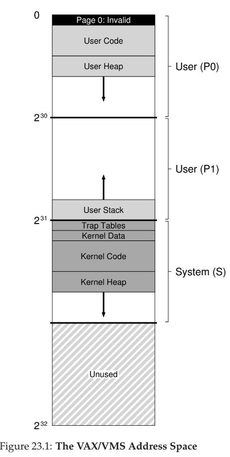
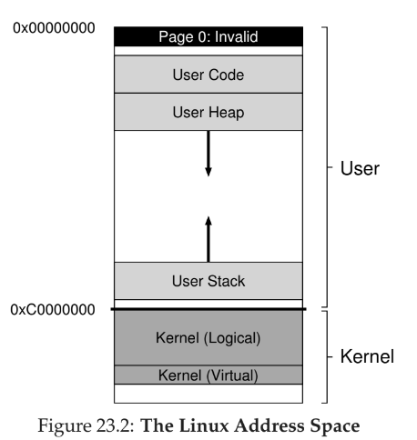

# 23 - Complete Virtual Memory Systems

## VAX/VMS Virtual Memory
- introduced in late 1970s by Digital Equipment Corporation (DEC)
- uses a hybrid of paging and segmentation

### Address Space
- lower half of address space called "process space" and is unique to each process
  - first half of process space (P0) contains user program and heap data and grows downwards
  - second half (P1) contains stack and grows upwards
- upper half of address space called system space (S)
  - only half used
  - contains OS data, and is shared across processes
- page 0 is reserved to aid in finding NULL pointer accesses
- because page tables can be allocated from kernel memory, translation is difficult -- hopefully TLB handles each translation

### Page Replacement
- page table entry contains
  - a valid bit
  - a protection field (4 bits)
  - a modify bit
  - an OS-reserved field (5 bits)
  - a physical frame number (PFN) to store location of page in physical memory
  - NO REFERENCE BIT!
- uses a segmented FIFO policy
  - each process has max pages it can keep in memory (resident set size RSS)
  - there is a second-chance list where pages that have fallen off the queue go (clean-page free list and dirty-page list)
  - if new process needs a page, it takes it off clean list (unless original process needs that page again first)
  - the bigger the second-chance lists are, the closer FIFO performs to LRU

### Other Optimizations
- **demand zeroing** - instead of clearing out a page immediately for another process to use, this happens lazily upon demand, which saves effort if the page is never read or written
- **copy-on-write** - when OS needs to copy one page from one address to another, it maps it and marks as read-only -- if it only needs to be read, it saves effort

## Linux
- divided between user and kernel portions of address space
- two types of kernel virtual addresses
    1. kernel logical addresses - contains most kernel data structures like page tables, per-process kernel stacks, apportioned by `kmalloc` and cannot be swapped to disk
    2. kernel virtual address - usually not contiguous, apportioned by `vmalloc` and used to allow the kernel to address more than ~1GB of memory (limitation of 32 bit system not much relevant anymore)

### Page Tables
- provides hardware-managed, multi-level page table structure -- one page table per process
- OS sets up mappings in memory and points register at the start of the page directory, hardware handles the rest
- OS is involved in process creation, deletion, context switches
- support for **huge pages** beyond the typical 4KB page
  - useful for certain workloads like databases
  - limits TLB misses and makes TLB allocation faster
  - could lead to large internal fragmentation, and swapping doesn't work well as I/O is expensive

### Page Cache
- unified, and keeps pages in memory from three sources
    1. memory-mapped files
    2. file data and metadata from devices (tracked from read() or write() calls)
    3. heap and stack pages for processes (called anonymous memory because no named file backing store)
- uses a 2Q replacement algorithm
  - keeps two lists and divides memory between
  - first time pages are put into **inactive** list
  - when page is re-referenced, it is promoted to **active** list
  - replacements are pulled from inactive list
  - not typically managed in perfect LRU order, but typically uses a clock algo to prevent full scans

## Security
- **buffer overflow** - allows attacker to insert arbitrary data into target's address space, and usually occurs when developer assumes input won't be overly long and inserts into a buffer -- can trigger a **privilege escalation**, which gives attacker access to privileged mode
- **return-oriented programming** - lots of pieces of code (gadgets) in program's address space, and by changing return address, attacker can string together gadgets to execute arbitrary code -- combatted by address space layout randomization (ASLR) which randomizes virtual address layout